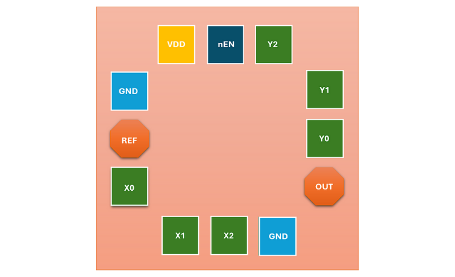
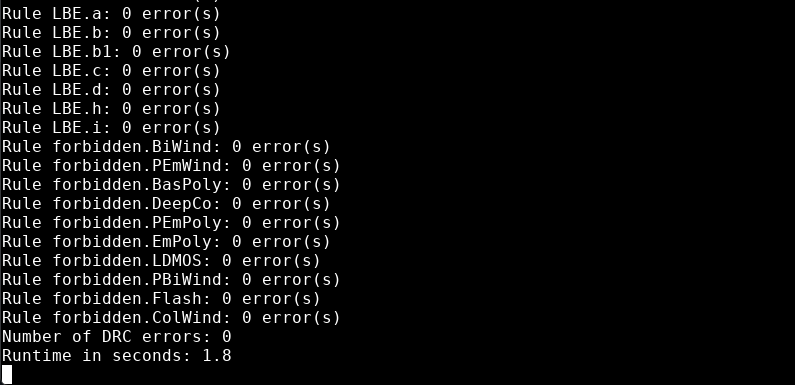

30 MHz Fractional-N PLL Design Data and Design Process Description
##################################################################

The design is primarily implements a charge-pump (CP) based **Type-II Phase-Locked Loop (PLL)** designed to generate programmable output frequencies from a stable ``10 MHz`` reference input. The architecture uses a Voltage-Controlled Oscillator (VCO) together with two 3-bit programmable Frequency Dividers (FDs) to achieve a tunable output frequency.

Architecture
------------

- **Feedback Divider (M):**  
  Divides the VCO output by a 3-bit integer input ``M``. This allows the PLL to lock the VCO frequency at an integer multiple of the reference input:  
  :math:`f_vco = M x f_ref`

- **Output Divider (N):**  
  Divides the VCO output by a 3-bit integer input ``N`` to produce the final output:  
  :math:`f_out = f_vco / N`

Frequency Relationship
----------------------

By configuring **M** and **N** via six digital I/O control pads (3 bits each), the system achieves a fractional multiplication of the reference input:

:math:`f_out = (M / N) x f_ref`

Since both ``M`` and ``N`` can be varied between ``1 and 7``, the **theoretical frequency range** spans from ``1.428 MHz to 70 MHz``, based on the 3-bit divider limits. However, due to VCO constraints, the **practical output frequency range** is limited to approximately ``1.428 MHz to 30 MHz``. This design demonstrates a compact, digitally controlled fractional frequency synthesizer suitable for clock generation and frequency scaling applications.

Circuit Design
##############

Phase-Locked Loop (PLL)
-----------------------

The top-level schematic of ``PLL_3BIT_DIV`` is shown below:

.. image:: _static/CIRCUIT_PLL_3BIT_DIV.png
    :align: center
    :alt: CIRCUIT_PLL_3BIT_DIV
    :width: 800

The PLL uses a standard fractional-N architecture, where a feedback and output frequency divider are used to set the frequency multiplication with respect to the reference clock input.

Phase-Frequency Detector (PFD)
------------------------------

.. image:: _static/CIRCUIT_PFD.png
    :align: center
    :alt: CIRCUIT_PFD
    :width: 800

Charge Pump (CP)
----------------

The charge pump uses two current sources (``bias_p`` and ``bias_n``), which are switched to the output by the ``up`` and ``down`` control signals. The nominal charge pump current (set by the bias generator) is configurable to suit the PLL requirements.

Loop Filter
-----------

.. image:: _static/CIRCUIT_LOOP_FILTER.png
    :align: center
    :alt: CIRCUIT_LOOP_FILTER
    :width: 800

Bias Generator
--------------

The bias generator design in this project is based on [1], but we added an extra resistor to increase ``bias_n`` value. The bias generator is a self-biased current mirror, which provides a roughly supply-independent current for the charge pump. A startup circuit is included to ensure the bias generator does not fall into an undesirable operating point where ``I_OUT = 0``. The diode devices ``M3`` and ``M7`` charge the ``kick`` node to ``VPWR`` when the circuit is enabled, which pulls ``bias_p`` low and establishes a current in the mirror devices. Once the mirror is active, ``M3`` pulls ``kick`` low and disables the startup circuit.

.. image:: _static/CIRCUIT_BIAS_GEN.png
    :align: center
    :alt: CIRCUIT_BIAS_GEN
    :width: 800

Voltage-Controlled Oscillator (VCO)
-----------------------------------

Each stage is a standard-cell inverter with delay controlled by current-limiting transistors. The use of 11 stages sets the oscillation frequency in the MHz range and improves phase noise performance by spreading delay across multiple elements.

Inverter for VCO
~~~~~~~~~~~~~~~

.. image:: _static/CIRCUIT_VCO_INV.png
    :align: center
    :alt: CIRCUIT_VCO_INV
    :width: 800

11-Stage Ring VCO
~~~~~~~~~~~~~~~~~

A control transistor operating in the triode region regulates the current supplied to the inverter chain, enabling smooth tuning of the oscillation frequency. Minimum channel-length devices are used to maximize the width-to-length ratio, reduce ``V_DSAT``, and minimize parasitic capacitances.

Low-threshold (LVT) NMOS devices are employed so that the control voltage operates around mid-supply, ensuring robust operation across process and temperature variations. The nominal oscillation frequency is approximately ``50 MHz``, with tuning capability around this point. Dedicated keeper devices are included to disable the oscillator during standby, achieving **zero static power consumption** when the circuit is turned off.

Frequency Divider (FD)
----------------------

A frequency divider is implemented using a 3-bit binary counter, followed by 3 XOR gates to compare the counter output with the division ratio input ``A[2..0]``. When the counter output is equal to ``BIT``, ``DIV_RST`` is immediately triggered, which resets the counter to 0 at the rising edge of ``CLK_IN``. As a result, the maximum division ratio from ``CLK_IN`` to ``DIV_RST`` is 7, when ``BIT == 3'b111``.

.. image:: _static/CIRCUIT_3BIT_FREQ_DIV.png
    :align: center
    :alt: CIRCUIT_3BIT_FREQ_DIV
    :width: 800

The D flip-flop (DFF) at the output is included to ensure an output duty cycle close to 50%. As a result, the actual output frequency is ``f_ref / (2 x BIT)``, which implies a division ratio from ``CLK_IN`` to ``CLK_OUT`` between 2 and 14.

Frequency Divider Cell
~~~~~~~~~~~~~~~~~~~~~~

.. image:: _static/CIRCUIT_FREQ_DIV_CELL.png
    :align: center
    :alt: CIRCUIT_FREQ_DIV_CELL
    :width: 800

The architecture of a 1-bit divider is shown above. Multiple instances of this cell is used to create the 3-bit divider.

Half Adder for Divider
~~~~~~~~~~~~~~~~~~~~~~

.. image:: _static/CIRCUIT_HALF_ADD.png
    :align: center
    :alt: CIRCUIT_HALF_ADD
    :width: 800

DFF with Inverted CLK for Divider
~~~~~~~~~~~~~~~~~~~~~~~~~~~~~~~~~~

.. image:: _static/CIRCUIT_DFF_nCLK.png
    :align: center
    :alt: CIRCUIT_DFF_nCLK
    :width: 800

Simulation Results (Pre-Layout)
###############################

Output Waveform of the VCO
--------------------------

We used the nominal control voltage as 1 V to characterize the VCO.

VCO Output Waveform at Control Voltage = 1 V
~~~~~~~~~~~~~~~~~~~~~~~~~~~~~~~~~~~~~~~~~~~

.. image:: _static/VCO_OUT_1V.png
    :align: center
    :alt: CIRCUIT_VCO_OUT_1V
    :width: 800

The output Frequency of the VCO at a control voltage of 1 V is approximately ``50 MHz`.

VCO Output Frequency Spectrum at Control Voltage = 1 V
~~~~~~~~~~~~~~~~~~~~~~~~~~~~~~~~~~~~~~~~~~~~~~~~~~~~~

.. image:: _static/VCO_OUT_SPECTRUM_1V.png
    :align: center
    :alt: CIRCUIT_VCO_OUT_SPECTRUM_1V
    :width: 800

VCO Oscillation Frequency vs Control Voltage
~~~~~~~~~~~~~~~~~~~~~~~~~~~~~~~~~~~~~~~~~~~~

The VCO was characterized by measuring its output frequency while sweeping the control voltage. The results of this simulation are shown below:

Operation of the Charge Pump
----------------------------

Since the pulse width of the ``up`` signal is wider than that of the ``down`` signal, ``v_out`` charges, gradually increasing its voltage with each pulse.

.. image:: _static/CHRG_PUMP_OUT.png
    :align: center
    :alt: CIRCUIT_CHRG_PUMP_OUT
    :width: 800

Frequency Divider Output Waveform for a Divider Ratio = 7
---------------------------------------------------------

Input frequency - 80 MHz
Output frequency - 5.71 MHz

Integrated PLL Simulation for M = 1 and N = 1
---------------------------------------------

Output frequency - 10.02 MHz

.. image:: _static/PLL_M1_N1.png
    :align: center
    :alt: PLL_M1_N1
    :width: 800

Layout Design
#############

Charge Pump Layout
------------------

Area: 26.03 µm²

.. image:: _static/LAYOUT_CHRG_PUMP.png
    :align: center
    :alt: LAYOUT_CHRG_PUMP
    :width: 800

Loop Filter Layout
------------------

Area: 297.89 µm²

.. image:: _static/LAYOUT_LOOP_FILTER.png
    :align: center
    :alt: LAYOUT_LOOP_FILTER
    :width: 800

Bias Generator Layout
---------------------

Area: 354.17 µm²

.. image:: _static/LAYOUT_BIAS_GEN.png
    :align: center
    :alt: LAYOUT_BIAS_GEN
    :width: 800

VCO Layout
----------

Area: 2246.58 µm²

.. image:: _static/LAYOUT_11STG_VCO.png
    :align: center
    :alt: LAYOUT_11STG_VCO
    :width: 800

Frequency Divider Layout
------------------------

Area: 715.22 µm²

.. image:: _static/LAYOUT_3BIT_FREQ_DIV.png
    :align: center
    :alt: LAYOUT_3BIT_FREQ_DIV
    :width: 800

Integrated PLL Layout (without Fillers)
---------------------------------------

Integrated PLL Layout (with Fillers)
------------------------------------

Area: 160000.00 µm²

PLL Pinout
----------

Layout Information
------------------

.. list-table:: 
   :widths: 15 15 15 15 15 25
   :header-rows: 1
   :align: center

   * - 
     - Width (µm)
     - Height (µm)
     - Pitch (µm)
     - Area (µm²)
     - Layers
   * - **Layout**
     - 400
     - 400
     - N/A
     - 160,000
     - all
   * - **Pads**
     - 60
     - 60
     - 75
     - 3,600
     - TM2 - M3
   * - **RF Pads**
     - 60
     - 60
     - 75
     - ~2,984
     - TM2 - TM1

Physical Verification (DRC, LVS)
################################

Design Rule Check (DRC) Results
-------------------------------

Layout vs. Schematics (LVS) Results
-----------------------------------

Post-layout Verification after PEX
##################################

Simulation of a Division Ratio of 1 (M = 1 and N = 1)
--------------------------------------------------

Output frequency - 8.03 MHz

.. image:: _static/PEX_PLL_M1_N1.png
    :align: center
    :alt: PEX_PLL_M1_N1
    :width: 800

Simulation of a Division Ratio of 1/7 (M = 1 and N = 7)
----------------------------------------------------

Output frequency - 1.43 MHz

.. image:: _static/PEX_PLL_M1_N7.png
    :align: center
    :alt: PEX_PLL_M1_N7
    :width: 800

Simulation of a Division Ratio of 3 (M = 3 and N = 1)
--------------------------------------------------

Output frequency - 27.71 MHz

.. image:: _static/PEX_PLL_M3_N1.png
    :align: center
    :alt: PEX_PLL_M3_N1
    :width: 800

Original Project Repository
###########################

This project repository contains the only the important design files and simulation results for the 30 MHz Fractional-N PLL. All the information regarding the draft designs and simulations can be found at the original project repository.

- cmos-pll-ihp-sg13g2 - https://github.com/SkillSurf/cmos-pll-ihp-sg13g2

References
##################################

The following open-source PLL designs were referred to during the development of this project:

[1] tt08-tiny-pll - https://github.com/LegumeEmittingDiode/tt08-tiny-pll
[2] avsdpll_1v8 - https://github.com/lakshmi-sathi/avsdpll_1v8