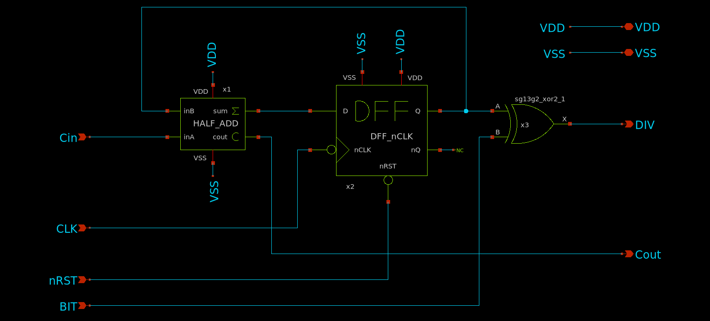
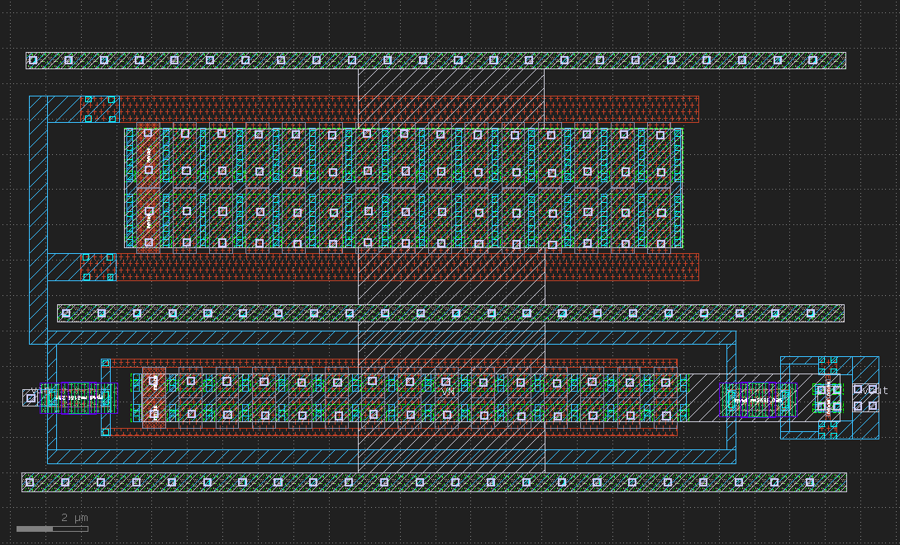

Design Data and Design Process Description
##########################################

The design is primarily implements a charge-pump (CP) based **Type-II Phase-Locked Loop (PLL)** designed to generate programmable output frequencies from a stable ``10 MHz`` reference input. The architecture uses a Voltage-Controlled Oscillator (VCO) together with two 3-bit programmable Frequency Dividers (FDs) to achieve a tunable output frequency.

Architecture
------------

- **Feedback Divider (M):**  
  Divides the VCO output by a 3-bit integer input ``M``. This allows the PLL to lock the VCO frequency at an integer multiple of the reference input:  
  :math:`f_vco = M x f_ref`

- **Output Divider (N):**  
  Divides the VCO output by a 3-bit integer input ``N`` to produce the final output:  
  :math:`f_out = f_vco / N`

Frequency Relationship
----------------------

By configuring **M** and **N** via six digital I/O control pads (3 bits each), the system achieves a fractional multiplication of the reference input:

:math:`f_out = (M / N) x f_ref`

Since both ``M`` and ``N`` can be varied between ``1 and 7``, the **theoretical frequency range** spans from ``1.428 MHz to 70 MHz``, based on the 3-bit divider limits. However, due to VCO constraints, the **practical output frequency range** is limited to approximately ``1.428 MHz to 30 MHz``. This design demonstrates a compact, digitally controlled fractional frequency synthesizer suitable for clock generation and frequency scaling applications.

Circuit Design
##############

Phase-Locked Loop (PLL)
-----------------------

.. image:: _static/CIRCUIT_PLL_3BIT_DIV.png
    :align: center
    :alt: IHP Logo Image.
    :width: 800

Phase-Frequency Detector (PFD)
------------------------------

.. image:: _static/CIRCUIT_PFD.png
    :align: center
    :alt: IHP Logo Image.
    :width: 800

Charge Pump (CP)
----------------

.. image:: _static/CIRCUIT_CHRG_PUMP.png
    :align: center
    :alt: IHP Logo Image.
    :width: 800

Loop Filter
-----------

Bias Generator
--------------

Voltage-Controlled Oscillator (VCO)
-----------------------------------

Inverter for VCO
~~~~~~~~~~~~~~~

.. image:: _static/CIRCUIT_VCO_INV.png
    :align: center
    :alt: IHP Logo Image.
    :width: 800

11-Stage Ring VCO
~~~~~~~~~~~~~~~~~

.. image:: _static/CIRCUIT_11STG_VCO.png
    :align: center
    :alt: IHP Logo Image.
    :width: 800

Frequency Divider (FD)
----------------------

.. image:: _static/CIRCUIT_3BIT_FREQ_DIV.png
    :align: center
    :alt: IHP Logo Image.
    :width: 800

Frequency Divider Cell
~~~~~~~~~~~~~~~~~~~~~~

Half Adder for Divider
~~~~~~~~~~~~~~~~~~~~~~

DFF with Inverterd CLK for Divider
~~~~~~~~~~~~~~~~~~~~~~~~~~~~~~~~~~

.. image:: _static/CIRCUIT_DFF_nCLK.png
    :align: center
    :alt: IHP Logo Image.
    :width: 800

Simulation Results (Pre-Layout)
###############################

Output Waveform of the VCO
--------------------------

VCO Output Waveform at Control Voltage = 1V
~~~~~~~~~~~~~~~~~~~~~~~~~~~~~~~~~~~~~~~~~~~

.. image:: _static/.png
    :align: center
    :alt: IHP Logo Image.
    :width: 800

VCO Output Frequency Spectrum at Control Voltage = 1V
~~~~~~~~~~~~~~~~~~~~~~~~~~~~~~~~~~~~~~~~~~~~~~~~~~~~~

.. image:: _static/.png
    :align: center
    :alt: IHP Logo Image.
    :width: 800

VCO Oscillation Frequency vs Control Voltage
~~~~~~~~~~~~~~~~~~~~~~~~~~~~~~~~~~~~~~~~~~~~

.. image:: _static/.png
    :align: center
    :alt: IHP Logo Image.
    :width: 800

Operation of the Charge Pump
----------------------------

.. image:: _static/.png
    :align: center
    :alt: IHP Logo Image.
    :width: 800

Frequency Divider Output Waveform for a Divider Ratio = 7
---------------------------------------------------------

.. image:: _static/.png
    :align: center
    :alt: IHP Logo Image.
    :width: 800

Layout Design
#############

Charge Pump Layout
------------------

.. image:: _static/LAYOUT_CHRG_PUMP.png
    :align: center
    :alt: IHP Logo Image.
    :width: 800

Loop Filter Layout
------------------

Bias Generator Layout
---------------------

VCO Layout
----------

Frequency Divider Layout
------------------------

.. image:: _static/LAYOUT_3BIT_FREQ_DIV.png
    :align: center
    :alt: IHP Logo Image.
    :width: 800

Integrated PLL Layout (without Fillers)
---------------------------------------

.. image:: _static/LAYOUT_PLL_NO_FILLERS.png
    :align: center
    :alt: IHP Logo Image.
    :width: 800

Integrated PLL Layout (with Fillers)
------------------------------------

.. image:: _static/LAYOUT_PLL_WITH_FILLERS.png
    :align: center
    :alt: IHP Logo Image.
    :width: 800

PLL Pinout
----------

.. image:: _static/PLL_PINOUT.png
    :align: center
    :alt: IHP Logo Image.
    :width: 800

Layout Information
------------------

|           | Width (µm) | Height (µm) | Pitch (µm) | Area (µm²) |   Layers   |
|-----------|------------|-------------|------------|------------|------------|
| Layout    | 400        | 400         | -          | 160,000    |    all     |
| Pads      | 60         | 60          | 75         | 3,600      |  TM2 -  M3 |
| RF Pads   | 60         | 60          | 75         | ~2,984     |  TM2 - TM1 |

Physical Verification (DRC, LVS)
################################

Design Rule Check (DRC) Results
-------------------------------

.. image:: _static/DRC.png
    :align: center
    :alt: IHP Logo Image.
    :width: 800

Layout vs. Schematics (LVS) Results
-----------------------------------

.. image:: _static/LVS.png
    :align: center
    :alt: IHP Logo Image.
    :width: 800

Post-layout Verification after PEX
##################################

Simulation of a Division Ratio of 1 (M = 1 and N = 1)
--------------------------------------------------

.. image:: _static/PEX_PLL_M1_N1.png
    :align: center
    :alt: IHP Logo Image.
    :width: 800

Simulation of a Division Ratio of 1/7 (M = 1 and N = 7)
----------------------------------------------------

.. image:: _static/.png
    :align: center
    :alt: IHP Logo Image.
    :width: 800

Simulation of a Division Ratio of 3 (M = 3 and N = 1)
--------------------------------------------------

.. image:: _static/.png
    :align: center
    :alt: IHP Logo Image.
    :width: 800

References
##################################

The following open-source PLL designs were referred to during the development of this project:
- [tt08-tiny-pll](https://github.com/LegumeEmittingDiode/tt08-tiny-pll)
- [avsdpll_1v8](https://github.com/lakshmi-sathi/avsdpll_1v8)